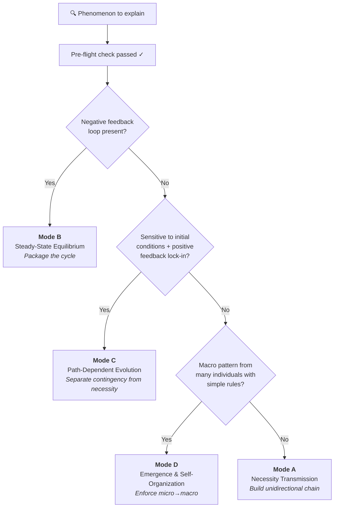

<div align="center">
  <h1>Causal Explanation Protocol</h1>
  <p>A structured protocol that makes AI (and humans) produce <b>rigorous causal explanations</b> — no circular reasoning, no false analogies, no pseudo-root-causes.</p>

  [](https://github.com/20kiki/causal-explanation-protocol/stargazers)
  [](LICENSE)
  [](https://claude.ai/code)
</div>

**Language:** [English](README.md) | [简体中文](zh-CN/README.md)

---

## 📋 Table of Contents
- [The Problem](#-the-problem)
- [Before / After](#-before--after)
- [How It Works](#-how-it-works)
- [The Four Modes](#-the-four-modes)
- [Example Walkthroughs](#-example-walkthroughs)
- [Quick Start](#-quick-start)
- [Installation](#-installation)
- [Topics](#topics)
- [Contributing](#-contributing)
- [License](#-license)

---

**Classify first, then explain. Audit the driving force, then build the chain.**

## 🔍 The Problem

Ever asked an AI "why does X happen?" and got an answer that *sounds* right but falls apart on inspection?

> *"Why does this sleeping pill work? Because it has a sedative effect."*

"Sedative effect" is just a fancy way of saying "makes you sleepy." The cause renames the effect — there's no real explanation. This protocol catches that.

## ⚡ Before / After

### Without the protocol
> *"Why does the room stay at 22°C? Because that's the temperature."*
>
> ❌ Circular — just renames the observation.

### With the protocol (Mode B: Steady-State Equilibrium)
> **Driving force audit:** The thermostat is set to 22°C (exogenous rule — someone chose it). When temperature drops below, it triggers the heater. When temperature rises above, it triggers the AC.
>
> **Steady state:** The thermostat + heater + AC form a negative-feedback loop. Heat leaks out, heater pushes back, AC cuts excess. The system bounces around 22°C — never perfectly still, but always returning. The setpoint is the attractor. Once you know the thermostat rule + heat loss rate + heater power, the behavior is locked in.
>
> ✅ The explanation packages the cycle as a steady-state module, anchored to the thermostat rule (exogenous). It doesn't unpack "heater → warm → off → cool → heater → warm..." in a circle.

[See more examples below](#example-walkthroughs)

## 🧠 How It Works

Every explanation runs through a **mandatory pre-flight check** before any reasoning begins:

### Step 1: Pitfall scan
| Fallacy | Detection |
| :--- | :--- |
| **Circular reasoning** | Does the "cause" need the "effect" to define itself? |
| **False analogy** | Is the analogy's causal structure actually isomorphic? |
| **Pseudo root cause** | Can you still ask "why" about the claimed cause? |

### Step 2: Driving force audit
Every claimed cause is traced to one of three ultimate sources:
- **Active intent** (design, decision, purpose)
- **Passive constraint** (physical law, conservation law, boundary condition)
- **Emergent regularity** (statistical inevitability from many individuals)

Only when you hit one of these three can you claim a *root cause*.

### Step 3: Mode classification


## 🗂️ The Four Modes

| Mode | Applies to | Starting cause | Core rule |
| :--- | :--- | :--- | :--- |
| **A: Necessity Transmission** | Passive physical/engineering systems | Independent conservation law or physical boundary | Chain must be unidirectional, unbranched, non-cyclic |
| **B: Steady-State Equilibrium** | Negative-feedback systems, rule-locked games | Mutually constraining rules (≥1 exogenous) | Package the cycle; don't unpack it step-by-step |
| **C: Path-Dependent Evolution** | Historical lock-in, initial-condition-sensitive | Bifurcation difference + amplification mechanism | Explain lock-in; don't explain why the specific fork was taken |
| **D: Emergence & Self-Organization** | Many individuals, simple local rules | Bottom-level individual rules | Enforce micro→macro; never macro→micro |

## 📖 Example Walkthroughs

Each example shows the **same question** answered two ways: a typical sloppy explanation, and the protocol-corrected version with the specific mistakes it caught.

### "Why did the server crash?"

<details>
<summary><b>❌ Without the protocol</b></summary>

> "Traffic surged and overloaded the server. The overload caused timeouts, which made the server unresponsive."

**What's wrong:**
- "Overload" is a redescription of the symptom, not a cause — why did traffic become a problem *this time*?
- Treats a potentially emergent failure (retry storm) as if it were a simple capacity problem (Mode A), which is a category error.
</details>

<details>
<summary><b>✅ With the protocol (Mode D + Layered Scoping)</b></summary>

**Layer scoping:** Application layer. We are not explaining physical fiber cuts or kernel deadlocks.

**Mode classification:** Mode D (Emergence & Self-Organization)

**Driving force audit:**
Each client follows a timeout-retry rule (exogenous, config-defined). When the server responds slowly, clients retry. This rule is a *passive constraint* — the client doesn't decide whether to retry; the config does.

**Explanation:**
A brief latency spike (e.g. DB slow query) causes the first few client timeouts → those clients retry, doubling request load → more timeouts → more retries → a retry storm emerges from the independent decisions of many clients following the same rule → no central coordinator, no attacker.

**Why this is better:**
The causal arrow is strictly micro→macro. The "overload" doesn't cause retries; each client's retry rule *collectively creates* the overload. And the fix is not "add more servers" (which would also retry) — it's adding jitter and backoff to the retry rule itself.
</details>

### "Why are housing prices so high in major cities?"

<details>
<summary><b>❌ Without the protocol</b></summary>

> "Housing prices are high because demand exceeds supply. High demand drives up prices, which signals more supply, but supply can't keep up, so prices stay high."

**What's wrong:**
- "Demand exceeds supply" is circular — it restates the observation (high price) as its own cause.
- "Supply can't keep up" is a pseudo-root-cause — *why* can't it keep up? The explanation never reaches an exogenous anchor.
</details>

<details>
<summary><b>✅ With the protocol (Mode B: Steady-State Equilibrium)</b></summary>

**Mode classification:** Mode B (Steady-State Equilibrium) — the housing market is a system with mutually constraining forces.

**Driving force audit:**
Three exogenous anchors:
1. **Land is non-reproducible** (passive physical constraint — you can't manufacture more land in a fixed location)
2. **Zoning regulations** (active intent — policy decisions that cap density)
3. **Population inflow** (emergent regularity — job concentration draws people to cities)

**Explanation:**
The system is jointly defined by two opposing forces. Demand pressure (driven by population inflow + job concentration) pushes prices upward. Land scarcity + zoning caps (exogenous constraints) limit the supply response. Their intersection is a high-price steady state. Whenever demand rises, price increases until it rations the constrained supply — the system is a stable attractor at a high price level, not a temporary imbalance.

**Why this is better:**
The explanation is anchored to three exogenous constraints, not to a self-referential "supply and demand." It explains why the system *stabilizes* at high prices rather than correcting — the constraints are permanent, not temporary frictions.
</details>

### "Why does wind form?"

<details>
<summary><b>❌ Without the protocol</b></summary>

> "Wind is caused by pressure differences in the atmosphere. High-pressure air moves toward low-pressure areas, creating wind."

**What's wrong:**
- Stops at "pressure differences" as if they were the root cause — but pressure differences are themselves caused by something deeper.
- The driving force is untraced: you can still ask "why are there pressure differences?"
</details>

<details>
<summary><b>✅ With the protocol (Mode A: Necessity Transmission)</b></summary>

**Mode classification:** Mode A (Necessity Transmission) — a passive physical system with no feedback loops.

**Driving force audit:**
The chain is traced until it hits an **independent, external physical boundary** that cannot be questioned further: solar radiation + Earth's spherical geometry + orbital tilt. This is a *passive constraint* — it's not designed, and it's not emergent; it's a fixed boundary condition of the planet.

**Explanation:**
Solar radiation (independent external energy source) → uneven heating of Earth's surface (equator vs. poles, day vs. night, land vs. sea) → air columns at different temperatures → differential expansion/contraction → density differences → horizontal pressure gradient (high ↔ low) → pressure gradient force pushes air from high to low pressure → wind.

Each step necessarily follows from the previous. Given uneven solar heating + the ideal gas law + fluid continuity, air *must* flow — there is no physical possibility of non-flow.

**Why this is better:**
The chain is unidirectional and unbranched, terminating at an immutable external boundary (solar radiation). "Pressure difference" is correctly positioned as an intermediate link, not the root cause. And Mode A's rule — "you must reach a conservation law or physical boundary" — forced the explanation past the obvious mid-point.
</details>

### "Why does a database deadlock occur?"

<details>
<summary><b>❌ Without the protocol</b></summary>

> "Transaction A holds lock 1 and waits for lock 2. Transaction B holds lock 2 and waits for lock 1. Neither can proceed, so they deadlock."

**What's wrong:**
- Unpacks the cycle step-by-step ("A waits for B, B waits for A...") instead of packaging it. The reader sees *how* the cycle works but doesn't understand *why* the system can't escape it.
- Doesn't identify the exogenous constraint that makes deadlock a *steady state* rather than a temporary blockage.
</details>

<details>
<summary><b>✅ With the protocol (Mode B: Steady-State Equilibrium)</b></summary>

**Mode classification:** Mode B (Steady-State Equilibrium) — the circular wait is a stable attractor. Without external intervention, the system never leaves this state.

**Driving force audit:**
The exogenous anchor is the database's **lock acquisition rule**: a transaction that cannot acquire a lock *blocks and waits indefinitely* rather than releasing its held locks and retrying. This rule is an *active intent* (design decision) — the database could have been designed differently (e.g., timeout + abort), but it wasn't.

**Explanation:**
The system is jointly defined by two constraints: (1) each transaction holds its acquired locks until commit, and (2) each transaction waits indefinitely for blocked locks. Together, these form a stable attractor — a state in which both transactions wait forever, with zero internal force capable of breaking the cycle. The deadlock is not a "conflict"; it's an *equilibrium state* the system converges to and cannot escape without external intervention (deadlock detector, timeout, or manual kill).

**Why this is better:**
Instead of narrating the cycle (unpacking), it packages it as a steady-state module — two rules jointly define an inescapable attractor. The explanation makes clear *why* deadlock is self-sustaining and *what kind* of fix is needed (break one of the two rules — e.g., add timeout → abort → release locks).
</details>

## 🚀 Quick Start

The skill is a single file — `SKILL.md`. There's nothing to build, no dependencies.

**Step 1 — Open terminal**
- **macOS / Linux:** Open Terminal
- **Windows:** Press `Win + R`, type `powershell`, press Enter

**Step 2 — Create the folder and download SKILL.md**

macOS / Linux:
```bash
mkdir -p ~/.claude/skills/causal-explanation-protocol
curl -o ~/.claude/skills/causal-explanation-protocol/SKILL.md https://raw.githubusercontent.com/20kiki/causal-explanation-protocol/master/SKILL.md
```

Windows (PowerShell):
```powershell
New-Item -ItemType Directory -Force -Path "$env:USERPROFILE\.claude\skills\causal-explanation-protocol"
Invoke-WebRequest -Uri "https://raw.githubusercontent.com/20kiki/causal-explanation-protocol/master/SKILL.md" -OutFile "$env:USERPROFILE\.claude\skills\causal-explanation-protocol\SKILL.md"
```

**Step 3 — Done.** Open Claude Code and ask any "why" or "what caused" question — the protocol kicks in automatically.

> To update later: re-run the same command. It overwrites the old file.

## 📦 Installation

### Claude Code
Drop `SKILL.md` into `~/.claude/skills/causal-explanation-protocol/`. See [Quick Start](#-quick-start) for the one-liner.

### Copilot CLI
Place `SKILL.md` in your Copilot CLI skills directory.

### Gemini CLI
Place `SKILL.md` in your Gemini CLI skills directory.

### Manual / Other platforms
The full protocol is a single Markdown file (`SKILL.md`). Read it directly or feed it as system instructions to any LLM.

## 📁 Structure

```
├── README.md          # You are here
├── SKILL.md           # Full protocol reference (English)
├── LICENSE            # MIT
└── zh-CN/
    ├── README.md      # 简体中文
    └── SKILL.md       # 中文协议完整参考
```

## Topics

[`claude-code`](https://github.com/topics/claude-code) [`causal-reasoning`](https://github.com/topics/causal-reasoning) [`explainability`](https://github.com/topics/explainability) [`skill`](https://github.com/topics/skill) [`prompt-engineering`](https://github.com/topics/prompt-engineering) [`critical-thinking`](https://github.com/topics/critical-thinking)

## 🤝 Contributing

Contributions welcome. See [CONTRIBUTING.md](CONTRIBUTING.md) for the protocol improvement process.

## 📄 License

MIT © 2026
