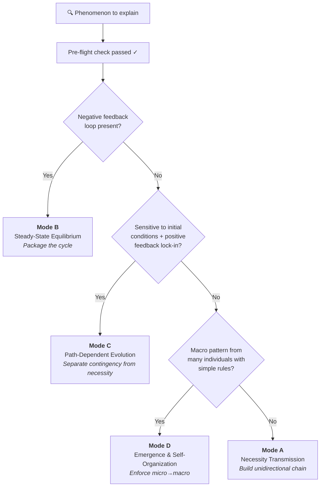

# Causal Explanation Protocol

**Language:** [English](README.md) | [简体中文](zh-CN/README.md)

[](LICENSE)
[](https://claude.ai/code)

A structured protocol that makes AI (and humans) produce **rigorous causal explanations** — no circular reasoning, no false analogies, no pseudo-root-causes.

**Classify first, then explain. Audit the driving force, then build the chain.**

---

## The Problem

Ever asked an AI "why does X happen?" and got an answer that *sounds* right but falls apart on inspection?

> *"Traffic jams happen because traffic density exceeds road capacity, causing a congestion wave that forces drivers to slow down..."*

This is circular: it uses the congestion wave (macro) to explain why drivers brake (micro), when in reality the causality runs the other way. This protocol catches that.

## Before / After

### Without the protocol
> "Stock prices fell because the market panicked. The panic caused more selling, which deepened the panic."
>
> ❌ Circular — "panic" defines itself through selling, and selling defines itself through panic.

### With the protocol (Mode B: Steady-State Equilibrium)
> **Driving force audit:** Traders follow a stop-loss rule (exogenous constraint). When price drops below a threshold, rule dictates immediate sell.
>
> **Steady state:** Price discovery normally balances buyers and sellers. A price shock below the stop-loss threshold triggers rule-driven selling, which pushes price further down, triggering more stop-losses. The system has a cascading attractor — once broken below the stop-loss cluster, it necessarily accelerates until all triggered orders clear.
>
> ✅ The explanation is anchored to an exogenous constraint (stop-loss rule), not to a self-referential "mood."

[See more examples below](#example-walkthroughs)

---

## How It Works

Every explanation runs through a **mandatory pre-flight check** before any reasoning begins:

### Step 1: Pitfall scan
| Fallacy | Detection |
|---------|-----------|
| **Circular reasoning** | Does the "cause" need the "effect" to define itself? |
| **False analogy** | Is the analogy's causal structure actually isomorphic? |
| **Pseudo root cause** | Can you still ask "why" about the claimed cause? |

### Step 2: Driving force audit
Every claimed cause is traced to one of three ultimate sources:
- **Active intent** (design, decision, purpose)
- **Passive constraint** (physical law, conservation law, boundary condition)
- **Emergent regularity** (statistical inevitability from many individuals)

Only when you hit one of these three can you claim a *root cause*.

### Step 3: Mode classification


---

## The Four Modes

| Mode | Applies to | Starting cause | Core rule |
|------|-----------|----------------|-----------|
| **A: Necessity Transmission** | Passive physical/engineering systems | Independent conservation law or physical boundary | Chain must be unidirectional, unbranched, non-cyclic |
| **B: Steady-State Equilibrium** | Negative-feedback systems, rule-locked games | Mutually constraining rules (≥1 exogenous) | Package the cycle; don't unpack it step-by-step |
| **C: Path-Dependent Evolution** | Historical lock-in, initial-condition-sensitive | Bifurcation difference + amplification mechanism | Explain lock-in; don't explain why the specific fork was taken |
| **D: Emergence & Self-Organization** | Many individuals, simple local rules | Bottom-level individual rules | Enforce micro→macro; never macro→micro |

---

## Example Walkthroughs

<details>
<summary><b>Why does a traffic jam form on a highway?</b></summary>

**Classification:** Mode D (Emergence & Self-Organization)

**Driving force audit:**
Each driver follows a simple rule — maintain safe following distance from the car ahead. This is a *passive constraint* (human reaction time + braking physics).

**Explanation:**
A single driver brakes slightly → the car behind brakes slightly harder (reaction delay) → this braking amplifies as it propagates backward → a "phantom jam" wave travels upstream at ~20 km/h → no central coordinator, no accident needed.

**Why this is rigorous:**
The causal arrow is strictly micro→macro. The jam wave does *not* cause drivers to brake; individual braking decisions *collectively form* the jam wave.
</details>

<details>
<summary><b>Why are most keyboards QWERTY?</b></summary>

**Classification:** Mode C (Path-Dependent Evolution)

**Driving force audit:**
The bifurcation was a contingent historical choice (1870s, typewriter-era layout). The lock-in mechanism is network effects + retraining costs.

**Explanation:**
QWERTY was selected for mechanical reasons in the typewriter era (contingent — we don't explain *why QWERTY won*). Once a critical mass of typists learned QWERTY, switching costs created a positive feedback loop: more QWERTY typists → more QWERTY keyboards manufactured → more QWERTY training → harder to displace. The system is locked in even though superior layouts exist.
</details>

---

## Installation

### Claude Code
```bash
cp SKILL.md ~/.claude/skills/causal-explanation-protocol/SKILL.md
```

### Copilot CLI
Place `SKILL.md` in your Copilot CLI skills directory.

### Gemini CLI
Place `SKILL.md` in your Gemini CLI skills directory.

### Manual / Other platforms
The full protocol is a single Markdown file (`SKILL.md`). Read it directly or feed it as system instructions to any LLM.

---

## Why "TDD for Skills"?

This protocol was built empirically: baseline agents were tested on causal explanation tasks *without* the skill. Their systematic failures (circular reasoning, false analogies, macro→micro reversals) were documented, and the protocol was written to address each specific failure pattern. The result is a protocol that defends against *observed* mistakes, not hypothetical ones.

---

## Structure

```
├── README.md          # You are here
├── SKILL.md           # Full protocol reference (English)
├── LICENSE            # MIT
└── zh-CN/
    ├── README.md      # 中文说明
    └── SKILL.md       # 中文协议完整参考
```

## Topics

`claude-code` `causal-reasoning` `explainability` `skill` `prompt-engineering` `critical-thinking`

---

## License

MIT © 2026
