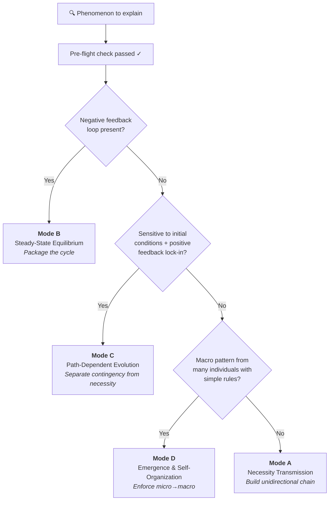

# Causal Explanation Protocol

**Language:** [English](README.md) | [简体中文](zh-CN/README.md)

A structured protocol that makes AI (and humans) produce **rigorous causal explanations** — no circular reasoning, no false analogies, no pseudo-root-causes.

**Classify first, then explain. Audit the driving force, then build the chain.**

---

## The Problem

Ever asked an AI "why does X happen?" and got an answer that *sounds* right but falls apart on inspection?

> *"Traffic jams happen because traffic density exceeds road capacity, causing a congestion wave that forces drivers to slow down..."*

This is circular: it uses the congestion wave (macro) to explain why drivers brake (micro), when in reality the causality runs the other way. This protocol catches that.

## Before / After

### Without the protocol
> "Stock prices fell because the market panicked. The panic caused more selling, which deepened the panic."
>
> ❌ Circular — "panic" defines itself through selling, and selling defines itself through panic.

### With the protocol (Mode B: Steady-State Equilibrium)
> **Driving force audit:** Traders follow a stop-loss rule (exogenous constraint). When price drops below a threshold, rule dictates immediate sell.
>
> **Steady state:** Price discovery normally balances buyers and sellers. A price shock below the stop-loss threshold triggers rule-driven selling, which pushes price further down, triggering more stop-losses. The system has a cascading attractor — once broken below the stop-loss cluster, it necessarily accelerates until all triggered orders clear.
>
> ✅ The explanation is anchored to an exogenous constraint (stop-loss rule), not to a self-referential "mood."

[See more examples below](#example-walkthroughs)

---

## How It Works

Every explanation runs through a **mandatory pre-flight check** before any reasoning begins:

### Step 1: Pitfall scan
| Fallacy | Detection |
|---------|-----------|
| **Circular reasoning** | Does the "cause" need the "effect" to define itself? |
| **False analogy** | Is the analogy's causal structure actually isomorphic? |
| **Pseudo root cause** | Can you still ask "why" about the claimed cause? |

### Step 2: Driving force audit
Every claimed cause is traced to one of three ultimate sources:
- **Active intent** (design, decision, purpose)
- **Passive constraint** (physical law, conservation law, boundary condition)
- **Emergent regularity** (statistical inevitability from many individuals)

Only when you hit one of these three can you claim a *root cause*.

### Step 3: Mode classification

---

## The Four Modes

| Mode | Applies to | Starting cause | Core rule |
|------|-----------|----------------|-----------|
| **A: Necessity Transmission** | Passive physical/engineering systems | Independent conservation law or physical boundary | Chain must be unidirectional, unbranched, non-cyclic |
| **B: Steady-State Equilibrium** | Negative-feedback systems, rule-locked games | Mutually constraining rules (≥1 exogenous) | Package the cycle; don't unpack it step-by-step |
| **C: Path-Dependent Evolution** | Historical lock-in, initial-condition-sensitive | Bifurcation difference + amplification mechanism | Explain lock-in; don't explain why the specific fork was taken |
| **D: Emergence & Self-Organization** | Many individuals, simple local rules | Bottom-level individual rules | Enforce micro→macro; never macro→micro |

---

## Example Walkthroughs

Each example shows the **same question** answered two ways: a typical sloppy explanation, and the protocol-corrected version with the specific mistakes it caught.

---

### "Why did the server crash?"

<b>❌ Without the protocol</b>

> "Traffic surged and overloaded the server. The overload caused timeouts, which made the server unresponsive."

**What's wrong:**
- "Overload" is a redescription of the symptom, not a cause — why did traffic become a problem *this time*?
- Treats a potentially emergent failure (retry storm) as if it were a simple capacity problem (Mode A), which is a category error.

<b>✅ With the protocol (Mode D + Layered Scoping)</b>

**Layer scoping:** Application layer. We are not explaining physical fiber cuts or kernel deadlocks.

**Mode classification:** Mode D (Emergence & Self-Organization)

**Driving force audit:**
Each client follows a timeout-retry rule (exogenous, config-defined). When the server responds slowly, clients retry. This rule is a *passive constraint* — the client doesn't decide whether to retry; the config does.

**Explanation:**
A brief latency spike (e.g. DB slow query) causes the first few client timeouts → those clients retry, doubling request load → more timeouts → more retries → a retry storm emerges from the independent decisions of many clients following the same rule → no central coordinator, no attacker.

**Why this is better:**
The causal arrow is strictly micro→macro. The "overload" doesn't cause retries; each client's retry rule *collectively creates* the overload. And the fix is not "add more servers" (which would also retry) — it's adding jitter and backoff to the retry rule itself.

---

### "Why are housing prices so high in major cities?"

<b>❌ Without the protocol</b>

> "Housing prices are high because demand exceeds supply. High demand drives up prices, which signals more supply, but supply can't keep up, so prices stay high."

**What's wrong:**
- "Demand exceeds supply" is circular — it restates the observation (high price) as its own cause.
- "Supply can't keep up" is a pseudo-root-cause — *why* can't it keep up? The explanation never reaches an exogenous anchor.

<b>✅ With the protocol (Mode B: Steady-State Equilibrium)</b>

**Mode classification:** Mode B (Steady-State Equilibrium) — the housing market is a system with mutually constraining forces.

**Driving force audit:**
Three exogenous anchors:
1. **Land is non-reproducible** (passive physical constraint — you can't manufacture more land in a fixed location)
2. **Zoning regulations** (active intent — policy decisions that cap density)
3. **Population inflow** (emergent regularity — job concentration draws people to cities)

**Explanation:**
The system is jointly defined by two opposing forces. Demand pressure (driven by population inflow + job concentration) pushes prices upward. Land scarcity + zoning caps (exogenous constraints) limit the supply response. Their intersection is a high-price steady state. Whenever demand rises, price increases until it rations the constrained supply — the system is a stable attractor at a high price level, not a temporary imbalance.

**Why this is better:**
The explanation is anchored to three exogenous constraints, not to a self-referential "supply and demand." It explains why the system *stabilizes* at high prices rather than correcting — the constraints are permanent, not temporary frictions.

---

## Installation
