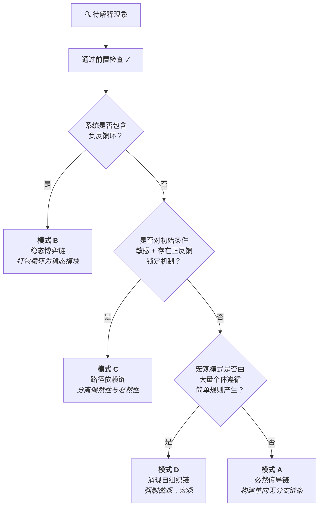

<div align="center">
  <h1>通用因果解释协议</h1>
  <p>一个让 AI（和人类）产出<b>严谨因果解释</b>的结构化协议——杜绝循环论证、错误类比、伪根本因。</p>

  [](https://github.com/20kiki/causal-explanation-protocol/stargazers)
  [](../LICENSE)
  [](https://claude.ai/code)
</div>

**Language:** [English](../README.md) | [简体中文](README.md)

---

## 📋 目录
- [它能解决什么](#它能解决什么)
- [使用效果对比](#使用效果对比)
- [工作流程](#工作流程)
- [四种模式速览](#四种模式速览)
- [案例详解](#案例详解)
- [快速开始](#快速开始)
- [安装](#安装)
- [贡献指南](#贡献指南)
- [许可证](#许可证)

---

**先分类，再解释。先审计驱动力，再构建链条。**

## 🔍 它能解决什么

有没有遇到过这种情况：你问 AI "为什么 X 会发生"，得到的答案*听起来*有道理，但仔细一想就站不住脚？

> *"堵车是因为车流密度超过了道路容量，形成拥堵波迫使司机减速……"*

这是循环论证：用拥堵波（宏观）来解释司机减速（微观），而实际上因果方向是反的。本协议专门捕捉这类错误。

## ⚡ 使用效果对比

### 不使用协议
> "股价下跌是因为市场恐慌了。恐慌导致更多人抛售，抛售又加剧了恐慌。"
>
> ❌ 循环论证——"恐慌"通过抛售定义自身，抛售又通过恐慌定义自身。

### 使用协议（模式 B：稳态博弈链）
> **驱动力溯源：** 交易者遵循止损规则（外生约束）。当价格跌破阈值时，规则要求立即卖出。
>
> **稳态机制：** 价格发现正常时买卖双方平衡。一次价格冲击跌破止损阈值后，触发规则驱动的卖出，进一步压低价格，触发更多止损。系统存在一个级联吸引子——一旦跌破止损密集区，必然加速下跌直到所有触发单清空。
>
> ✅ 解释锚定在外生约束（止损规则）上，而非自我指涉的"情绪"。

[更多案例见下方](#案例详解)

## 🧠 工作流程

每个解释在开始推理之前，都必须通过**前置检查**：

### 第一步：陷阱识别
| 谬误类型 | 检测问题 |
| :--- | :--- |
| **循环论证** | "因"是否需要"果"来定义自身？ |
| **错误类比** | 类比的因果结构是否真正同构？ |
| **伪根本因** | 声称的"因"还能继续追问"为什么"吗？ |

### 第二步：驱动力溯源审计
每个声称的"因"都必须追溯到以下三类终极来源之一：
- **主动意图**（设计、决策、目的性行为）
- **被动约束**（物理定律、守恒律、边界条件）
- **涌现规律**（大量个体的统计必然性）

追到这三类之一，才能宣称找到了"根本因"。

### 第三步：模式分流


## 🗂️ 四种模式速览

| 模式 | 适用对象 | 起始因 | 核心约束 |
| :--- | :--- | :--- | :--- |
| **A: 必然传导链** | 被动物理/工程系统 | 独立守恒律或物理边界 | 链条单向、无分支、非循环 |
| **B: 稳态博弈链** | 负反馈系统、规则锁定的博弈 | 相互制衡的规则（≥1 个外生） | 打包循环，禁止逐段解包 |
| **C: 路径依赖链** | 历史锁定、初始条件敏感 | 分叉差异 + 正反馈放大机制 | 解释锁定，不解释为何选中特定分叉 |
| **D: 涌现自组织链** | 大量个体、简单规则 | 底层个体规则 | 强制微观→宏观，禁止反向 |

## 📖 案例详解

每个案例展示**同一个问题**的两种回答：一个典型的糟糕解释，以及协议修正后的版本——并标注协议具体捕捉到了什么错误。

### "服务器为什么会崩？"

<details>
<summary><b>❌ 不使用协议</b></summary>

> "流量激增把服务器打爆了。过载导致超时，超时导致服务器无响应。"

**问题在哪：**
- "过载"只是症状的重新描述，不是原因——为什么*这次*流量就成了问题？
- 把可能属于涌现型故障（重试风暴）的现象当成简单容量问题（模式 A），是范畴错误。
</details>

<details>
<summary><b>✅ 使用协议（模式 D + 分层因果锁定）</b></summary>

**锁定层级：** 应用层。我们不是在解释光纤被挖断或内核死锁。

**模式分类：** 模式 D（涌现与自组织链）

**驱动力溯源：**
每个客户端遵循超时-重试规则（外生的、配置文件定义的）。服务器响应变慢时，客户端自动重试。这条规则是被动约束——客户端无法决定"要不要重试"，配置决定了它必​​须重试。

**解释：**
一次短暂延迟（如数据库慢查询）导致前几个客户端超时 → 这些客户端重试，请求量翻倍 → 更多超时 → 更多重试 → 重试风暴从成千上万个客户端各自独立遵循同一条规则的过程中涌现 → 没有中央协调者，没有攻击者。

**为什么更好：**
因果箭头严格从微观指向宏观。"过载"不导致重试；每个客户端的重试规则*集体构成了*过载。而且修复方案不是"加服务器"（加了也一样重试）——而是在重试规则中引入 jitter 和退避。
</details>

### "一线城市房价为什么这么高？"

<details>
<summary><b>❌ 不使用协议</b></summary>

> "房价高是因为供不应求。需求旺盛推高房价，价格信号刺激供给，但供给跟不上，所以价格居高不下。"

**问题在哪：**
- "供不应求"是循环论证——把观察到的现象（价格高）重新表述为原因。
- "供给跟不上"是伪根本因——*为什么*跟不上？解释从未触及外生锚点。
</details>

<details>
<summary><b>✅ 使用协议（模式 B：稳态博弈链）</b></summary>

**模式分类：** 模式 B（稳态博弈链）——房地产市场是相互制衡的力量构成的系统。

**驱动力溯源（三个外生锚点）：**
1. **土地不可再生**（被动物理约束——你无法在固定位置制造更多土地）
2. **规划管制**（主动意图——限制密度的政策决策）
3. **人口流入**（涌现规律——就业集中吸引人口向城市聚集）

**解释：**
系统由两股对立力量共同定义。需求压力（由人口流入 + 就业集中驱动）向上推高价格。土地稀缺 + 规划管制（外生约束）限制了供给响应。两者的交点就是高房价稳态。每当需求上升，价格必须上涨到足以出清受约束的供给为止——系统稳定在高价位，而不是临时的供需失衡。

**为什么更好：**
解释锚定在三个外生约束上，而非自我指涉的"供需关系"。它解释了为什么系统*稳定在*高价位而非自我修正——约束是永久性的，不是临时摩擦。
</details>

### "风是怎么产生的？"

<details>
<summary><b>❌ 不使用协议</b></summary>

> "风是由大气压差引起的。高压空气向低压区域移动，形成风。"

**问题在哪：**
- 止步于"气压差"，好像它是根本因——但气压差本身还有更深的驱动力。
- 驱动力未溯源：你仍然可以追问"为什么会有气压差？"
</details>

<details>
<summary><b>✅ 使用协议（模式 A：必然传导链）</b></summary>

**模式分类：** 模式 A（必然传导链）——被动物理系统，无反馈环。

**驱动力溯源：**
链条追溯到**独立、外在的物理边界**——无可进一步追问的终极因：太阳辐射 + 地球球体几何 + 轨道倾角。这是*被动约束*——非设计、非涌现，而是地球的固定边界条件。

**解释：**
太阳辐射（独立外在能量源）→ 地球表面不均匀受热（赤道/极地、昼夜、海陆差异）→ 空气柱温度差异 → 空气膨胀/收缩 → 密度差异 → 水平气压梯度（高压 ↔ 低压）→ 气压梯度力推动空气从高压移向低压 → 风。

每一步都必然从前一步导出。给定不均匀太阳加热 + 理想气体定律 + 流体连续性，空气*必然*流动——不存在"可以不流"的物理可能。

**为什么更好：**
链条单向无分支，终止于不可变的外部边界（太阳辐射）。"气压差"被正确定位为中间环节而非根本因。模式 A 的规则——"必须追到守恒律或物理边界"——迫使解释越过显而易见的中点继续向下追溯。
</details>

### "数据库为什么会发生死锁？"

<details>
<summary><b>❌ 不使用协议</b></summary>

> "事务 A 持有锁 1，等待锁 2。事务 B 持有锁 2，等待锁 1。双方都无法继续，于是死锁。"

**问题在哪：**
- 逐段解包循环（"A 等 B，B 等 A……"），而非打包。读者看到了循环的*运转方式*，但不理解系统为什么*无法逃脱*。
- 没有辨识出让死锁成为*稳态*而非临时阻塞的外生约束。
</details>

<details>
<summary><b>✅ 使用协议（模式 B：稳态博弈链）</b></summary>

**模式分类：** 模式 B（稳态博弈链）——循环等待是一个稳定吸引子。在无外部干预的情况下，系统永远不会自行离开此状态。

**驱动力溯源：**
外生锚点是数据库的**锁获取规则**：无法获取锁的事务*无限期阻塞等待*，而非释放已持有的锁并重试。这条规则属于*主动意图*（设计决策）——数据库本可以设计为超时 + 中止，但没有。

**解释：**
系统由两条约束共同定义：(1) 每个事务持有已获取的锁直到提交；(2) 每个事务无限期等待被阻塞的锁。两者共同构成稳定吸引子——在这个状态中，两个事务永远等待，且系统内部没有任何力量能够打破循环。死锁不是"冲突"，而是系统收敛到的、无法自行逃离的*均衡状态*，必须依赖外部干预（死锁检测器、超时机制或手动杀进程）才能解除。

**为什么更好：**
不是叙述循环（解包），而是打包为稳态模块——两条规则共同定义了一个不可逃脱的吸引子。解释明确了死锁*为何自我维持*，以及需要*哪一类*修复（打破两条规则之一——例如：加超时 → 中止 → 释放锁）。
</details>

## 🚀 快速开始

> **前置条件：** 电脑上已安装 `git`。在终端输入 `git --version` 能正常输出版本号即可。

**第一步 — 打开终端**
- **Windows：** 按 `Win + R`，输入 `powershell`，回车
- **macOS：** 按 `Cmd + 空格`，输入 `terminal`，回车
- **Linux：** 你懂的 😄

**第二步 — 复制下面这条命令，粘贴到终端里回车**（在哪个目录下执行都可以）：

```bash
git clone https://github.com/20kiki/causal-explanation-protocol.git ~/.claude/skills/causal-explanation-protocol
```

**第三步 — 完成。** skill 已安装。打开 Claude Code，提出任何「为什么」「是什么原因导致」类的问题，协议会自动介入。

> 这条命令会把项目文件（几 KB 的纯文本）下载到 Claude Code 的 skills 文件夹。以后想更新，在 skills 文件夹下执行 `git pull` 即可。

## 📦 安装

### Claude Code
```bash
git clone https://github.com/20kiki/causal-explanation-protocol.git ~/.claude/skills/causal-explanation-protocol
```

### Copilot CLI
将 `SKILL.md` 放入你的 Copilot CLI skills 目录。

### Gemini CLI
将 `SKILL.md` 放入你的 Gemini CLI skills 目录。

### 手动 / 其他平台
完整协议就是一个 Markdown 文件（`SKILL.md`）。直接阅读，或将其作为系统指令提供给任何 LLM。

## 📁 项目结构

```
├── README.md          # 当前文件
├── SKILL.md           # 完整协议参考（英文）
├── LICENSE            # MIT
└── zh-CN/
    ├── README.md      # 中文说明
    └── SKILL.md       # 中文协议完整参考
```

## 标签

`claude-code` `causal-reasoning` `explainability` `skill` `prompt-engineering` `critical-thinking`

## 🤝 贡献指南

欢迎贡献。协议改进流程详见 [CONTRIBUTING.md](../CONTRIBUTING.md)。

## 📄 许可证

MIT © 2026
