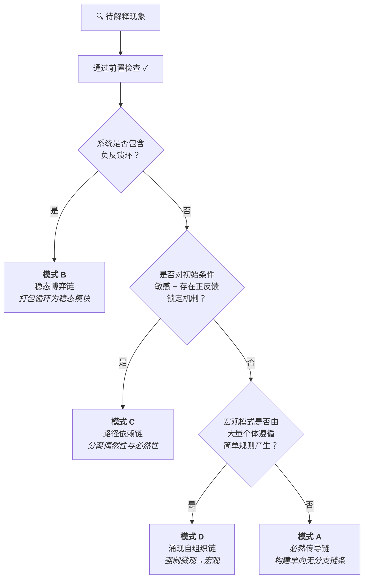

# 通用因果解释协议

**Language:** [English](../README.md) | [简体中文](README.md)

[](../LICENSE)
[](https://claude.ai/code)

一个让 AI（和人类）产出**严谨因果解释**的结构化协议——杜绝循环论证、错误类比、伪根本因。

**先分类，再解释。先审计驱动力，再构建链条。**

---

## 它解决什么问题

有没有遇到过这种情况：你问 AI "为什么X会发生"，得到的答案*听起来*有道理，但仔细一想就站不住脚？

> *"堵车是因为车流密度超过了道路容量，形成拥堵波迫使司机减速……"*

这是循环论证：用拥堵波（宏观）来解释司机减速（微观），而实际上因果方向是反的。本协议专门捕捉这类错误。

## Before / After（使用效果对比）

### 不使用协议
> "股价下跌是因为市场恐慌了。恐慌导致更多人抛售，抛售又加剧了恐慌。"
>
> ❌ 循环论证——"恐慌"通过抛售定义自身，抛售又通过恐慌定义自身。

### 使用协议（模式 B：稳态博弈链）
> **驱动力溯源：** 交易者遵循止损规则（外生约束）。当价格跌破阈值时，规则要求立即卖出。
>
> **稳态机制：** 价格发现正常时买卖双方平衡。一次价格冲击跌破止损阈值后，触发规则驱动的卖出，进一步压低价格，触发更多止损。系统存在一个级联吸引子——一旦跌破止损密集区，必然加速下跌直到所有触发单清空。
>
> ✅ 解释锚定在外生约束（止损规则）上，而非自我指涉的"情绪"。

[更多案例见下方](#案例详解)

---

## 工作流程

每个解释在开始推理之前，都必须通过**前置检查**：

### 第一步：陷阱识别
| 谬误类型 | 检测问题 |
|---------|---------|
| **循环论证** | "因"是否需要"果"来定义自身？ |
| **错误类比** | 类比的因果结构是否真正同构？ |
| **伪根本因** | 声称的"因"还能继续追问"为什么"吗？ |

### 第二步：驱动力溯源审计
每个声称的"因"都必须追溯到以下三类终极来源之一：
- **主动意图**（设计、决策、目的性行为）
- **被动约束**（物理定律、守恒律、边界条件）
- **涌现规律**（大量个体的统计必然性）

追到这三类之一，才能宣称找到了"根本因"。

### 第三步：模式分流


---

## 四种模式速览

| 模式 | 适用对象 | 起始因 | 核心约束 |
|------|---------|--------|---------|
| **A: 必然传导链** | 被动物理/工程系统 | 独立守恒律或物理边界 | 链条单向、无分支、非循环 |
| **B: 稳态博弈链** | 负反馈系统、规则锁定的博弈 | 相互制衡的规则（≥1 个外生） | 打包循环，禁止逐段解包 |
| **C: 路径依赖链** | 历史锁定、初始条件敏感 | 分叉差异 + 正反馈放大机制 | 解释锁定，不解释为何选中特定分叉 |
| **D: 涌现自组织链** | 大量个体、简单规则 | 底层个体规则 | 强制微观→宏观，禁止反向 |

---

## 案例详解

<details>
<summary><b>高速公路为什么会产生堵车？</b></summary>

**分类：** 模式 D（涌现自组织链）

**驱动力溯源：**
每位司机遵循一条简单规则——与前车保持安全距离。这是*被动约束*（人类反应时间 + 刹车物理）。

**解释：**
一位司机轻踩刹车 → 后车因反应延迟刹车稍重 → 刹车行为向后传播并逐级放大 → "幽灵堵车波"以约 20 km/h 的速度向上游传播 → 无需中央协调，无需事故发生。

**为什么这是严谨的：**
因果箭头严格从微观指向宏观。堵车波不*导致*司机刹车；每个司机的刹车行为*集体构成了*堵车波。
</details>

<details>
<summary><b>为什么大多数键盘是 QWERTY 布局？</b></summary>

**分类：** 模式 C（路径依赖链）

**驱动力溯源：**
分叉点是偶然的历史选择（1870 年代，打字机时代的设计）。锁定机制是网络效应 + 重新培训成本。

**解释：**
QWERTY 因打字机时代的机械原因被选中（这属于偶然性，不解释*为什么是 QWERTY 赢了*）。一旦足够多的打字员学会了 QWERTY，转换成本形成了正反馈：更多 QWERTY 打字员 → 更多 QWERTY 键盘被制造 → 更多人接受 QWERTY 培训 → 更难替代。即使存在更优布局，系统已被锁定。
</details>

---

## 安装

### Claude Code
```bash
cp SKILL.md ~/.claude/skills/causal-explanation-protocol/SKILL.md
```

### Copilot CLI
将 `SKILL.md` 放入你的 Copilot CLI skills 目录。

### Gemini CLI
将 `SKILL.md` 放入你的 Gemini CLI skills 目录。

### 手动 / 其他平台
完整协议就是一个 Markdown 文件（`SKILL.md`）。直接阅读，或将其作为系统指令提供给任何 LLM。

---

## 为什么是「TDD for Skills」？

本协议以实证方式构建：先让未加载 skill 的 agent 执行因果解释任务，记录其系统性失败（循环论证、错误类比、宏观→微观逆转），再针对性地编写协议修复每个失败点。结果是——协议防御的是*实际观察到的*错误，而非假想的错误。

---

## 项目结构

```
├── README.md          # 当前文件
├── SKILL.md           # 完整协议参考（英文）
├── LICENSE            # MIT
└── zh-CN/
    ├── README.md      # 中文说明
    └── SKILL.md       # 中文协议完整参考
```

## 标签

`claude-code` `causal-reasoning` `explainability` `skill` `prompt-engineering` `critical-thinking`

---

## 许可证

MIT © 2026
